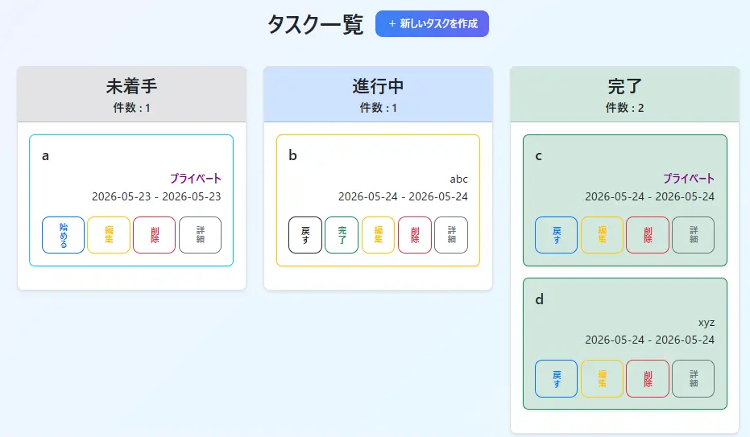
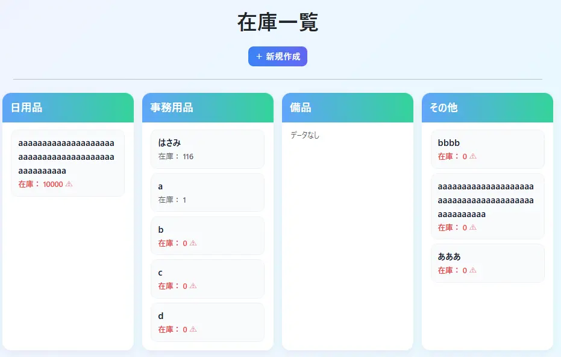
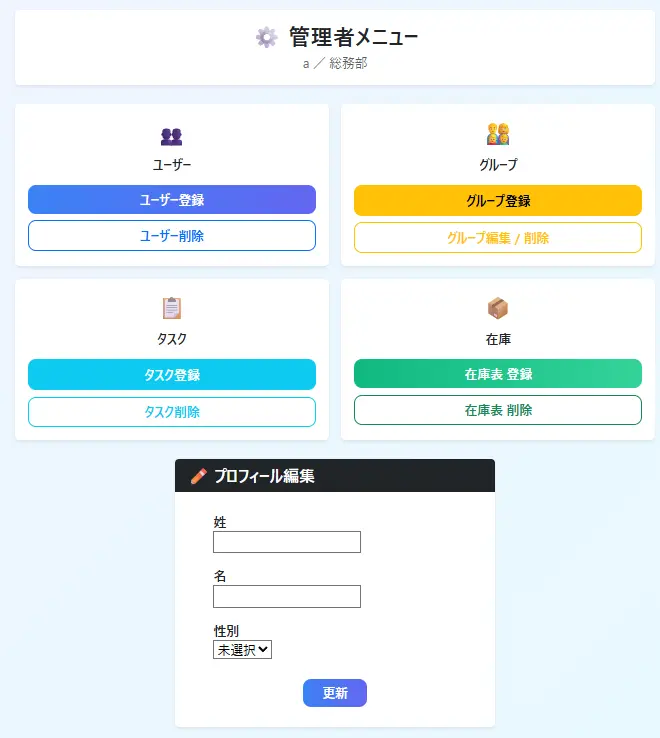
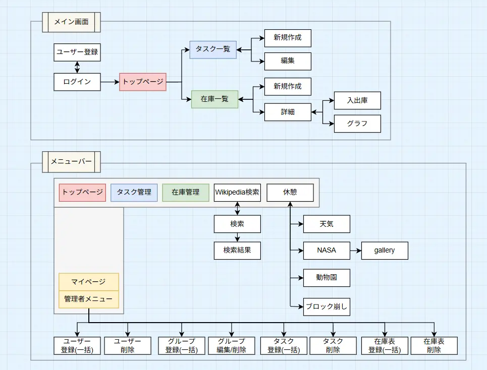
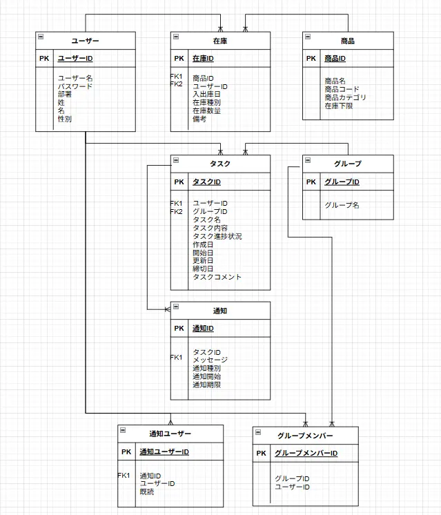
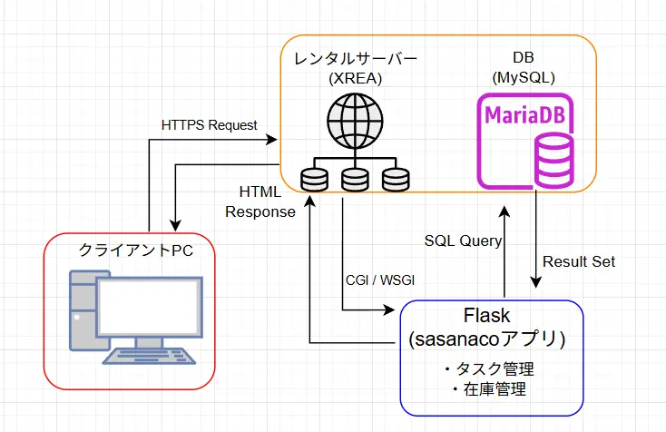

# Teamsasanaco

## システム概要

タスク管理と在庫管理をWEB上で行えるアプリケーションです。
チームでタスクや在庫管理を簡単に共有/確認することを目的としています。

管理者権限によるユーザー・グループ管理機能や、REST APIを利用した外部サービス連携機能も実装しています。

---
## 主な機能
### ログイン機能
- ログイン
- ログアウト
- セッション管理
### タスク管理機能
- タスク作成/編集/削除
- 状態変更
- コメント
### 在庫管理機能
- 在庫表作成/削除
- 在庫の入出庫
### 休憩機能
- 天気情報表示
- NASA画像閲覧
- 動物園ページ
- ブロック崩しゲーム
### Wiki検索機能
- 検索
### マイページ/管理者メニュー機能
- ユーザー一括登録/削除(管理者権限)
- グループ一括登録/編集/削除(管理者権限)
- タスク一括登録/削除(管理者権限)
- 在庫表一括登録/削除(管理者権限)

---
## 工夫したポイント

- Flask Blueprintを利用して機能ごとにモジュールを分割
- Flask-MigrateによるDBマイグレーション管理
- ユーザー権限に応じたアクセス制御を実装
　- システムで最初に登録されたユーザーのみ管理者権限を持つ
  - 管理者のみ管理者ページ表示。一般ユーザーはマイページ表示
  - タスクは作成者のみ削除可能
  - 在庫表は管理者のみ削除可能
- REST APIを利用した外部サービス連携

---
## ドキュメント

本プロジェクトでは、実装だけでなく設計・テスト工程も意識して開発を行いました。

作成資料：

sasanacoアプリ仕様書
テーブル詳細
ライブラリ一覧
ファイル構成図
画面仕様書
テスト仕様書

これらの資料は `documents` フォルダに格納しています。
また、ER図などの設計資料はREADME内にも掲載しています。

---
## 使用技術
### バックエンド
- Python 3.11
- Flask 3.1
### フロントエンド
- HTML/CSS
- JavaScript
- Bootstrap
### データベース
- MySQL
### 開発環境
- Anaconda
- Visual Studio Code
- MySQL Workbench
- Tera Term
- FFFTP

---
## 画面イメージ

### タスク管理


### 在庫画面


### 管理者メニュー


---
## 画面遷移図


## ER図


## システム構成図


---
## ファイル構成
```
sasanaco/
├─ alert/
├─ auth/
├─ migrations/
├─ mypage/
├─ rest/
├─ static/
│   ├─ css/
│   ├─ js/
│   └─ picture/
├─ stock/
├─ task/
├─ templates/
│   ├─ auth/
│   ├─ errors/
│   ├─ mypage/
│   ├─ rest/
│   ├─ stock/
│   ├─ task/
│   │   └─ modal/
│   ├─ top/
│   ├─ wiki/
│   ├─ _formhelpers.html
│   └─ base.html
├─ top/
├─ wiki/
├─ app.py
├─ config.py
├─ constants.py
├─ forms.py
├─ models.py
├─ views.py
├─ .env.example
├─ .gitignore
├─ requirements.txt
└─ environment.yml
```
---

## セットアップ

### 1. リポジトリをクローン

```bash
git clone <repository_url>
cd teamsasanaco
```

### 2. 仮想環境作成

#### Anacondaを使用する場合

```bash
conda env create -f environment.yml
conda activate teamsasanaco
```

#### venvを使用する場合

```bash
python -m venv venv

# Windows
venv\Scripts\activate

# Linux/macOS
source venv/bin/activate

pip install -r requirements.txt
```

### 3. MySQLデータベース作成

```sql
CREATE DATABASE teamsasanaco CHARACTER SET utf8mb4;
```

### 4. 環境変数設定

`.env.example` を参考に `.env` を作成してください。

### 5. マイグレーション実行

```bash
flask db upgrade
```

### 6. アプリ起動

```bash
flask run
```
